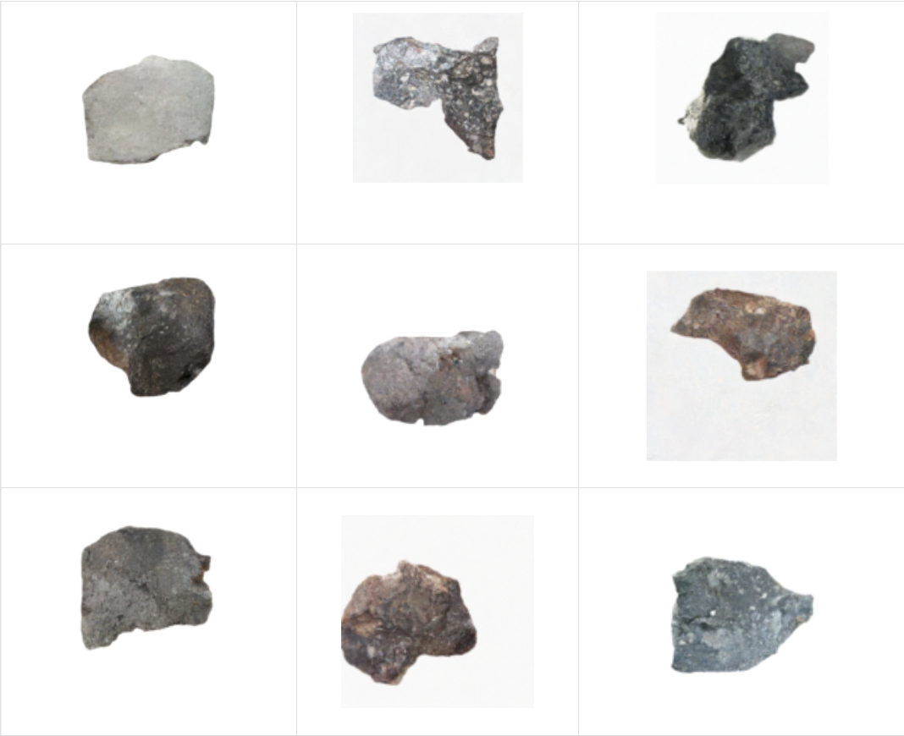

# Meteorite Image Generation

This project explores meteorite image generation using diffusion-based generative models.  
The goal is to train a model on the provided meteorite dataset and generate new meteorite images with a clean white background.

## Overview

The main approach is based on a **Denoising Diffusion Probabilistic Model (DDPM)** trained from scratch.  
A U-Net style denoising network is used to gradually recover meteorite images from Gaussian noise.

To improve the generation quality, the pipeline applies **foreground cropping** to reduce the effect of large white background regions, uses **EMA checkpoints** for more stable sampling, and generates images with a **1000-step DDPM sampling process**.

## Tried Methods

Several methods and variants were tested during the project:

- **Baseline DDPM**  
  A smaller DDPM model trained at lower resolution. It could learn rough meteorite shapes, but the generated images were blurry and lacked realistic texture.

- **Improved DDPM**  
  The main and best-performing method. It uses 128×128 images, a larger U-Net, AdamW optimizer, foreground cropping, EMA checkpoints, and 1000-step sampling.

- **256×256 DDPM**  
  A higher-resolution DDPM experiment. Although it increased image size, training became more difficult and the white background dominated the data distribution when foreground cropping was disabled.

- **DDPM with Bottleneck Attention**  
  A self-attention module was added at the bottleneck of the U-Net to improve global structure modeling, but it did not outperform the improved DDPM setting.

- **Stable Diffusion 1.5 with LoRA Fine-tuning**  
  A LoRA fine-tuning branch was also explored. It generated more realistic rock-like textures, but the background was harder to control and sometimes included shadows, gray backgrounds, or non-white scenes.

## Final Choice

The final selected model is the **improved DDPM** with:

- 128×128 image resolution
- U-Net denoising network
- foreground cropping
- AdamW optimizer
- EMA checkpointing
- 1000-step DDPM sampling

This setup produced the most stable white-background meteorite images among the tested methods and achieved the best FID score in the experiments.